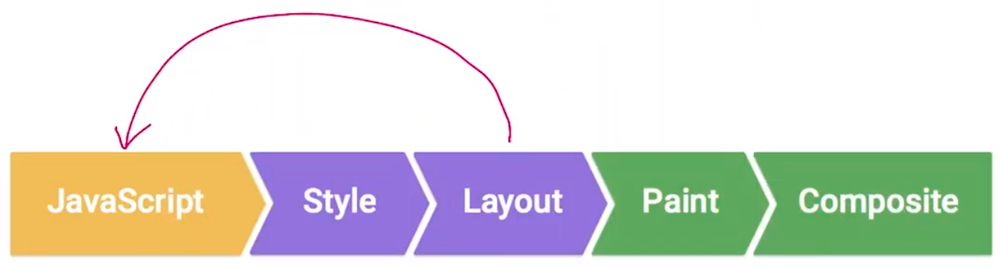

# Browser Rendering Optimization
Reference link: https://www.udacity.com/course/browser-rendering-optimization--ud860

---

## Lesson 5: Styles and Layout

### Recalculate styles

Click a button to add toggled class on body element and recalculate and paint style but **1000** of the box is inside of **box-container** element.

```css
body.toggled main .box-container .box:nth-child(2n) {
  background: #777 !important;
}
```
This style take a long time. estimate time is 61 milliseconds.

<br />
<br />

Rather than do this work using JavaScript.

in **JS**
```javascript
document.body.classList.toggle('toggled');

var boxes = container.querySelectorAll('.box');
for (var i = 1; i < boxes.length; i+=2) {
    document.body.classList.toggle('gray', document.body.contains('toggled'))
}
```

In **CSS**
```css
.box.gray {
    background-color: #fff;
}
```
This style take a only 5 milliseconds.


___
### Layout Thrashing {#layout-thrashing}

Every single paragraph cause is layout then recalculate style inside of for loop.
```javascript
var paragraphs = document.querySelectorAll('p');
var greenBlock = document.getElementById('block');

for (var p = 0; p < paragraphs.length; p++) {
    var blockWidth = greenBlock.offsetWidth;
    paragraphs[p].style.width = blockWidth + 'px';
}
```
This put browser into a cycle where you read and write a lot of values and we call this **layout thrashing**.
___
### Forced Synchronous Layout (FSL)
Read First [Layout Thrashing](#layout-thrashing).



It is, however, possible to force a browser to perform layout earlier with JavaScript. It is called a forced synchronous layout.

Stop **FSL**
```javascript
var paragraphs = document.querySelectorAll('p');
var greenBlock = document.getElementById('block');

var blockWidth = greenBlock.offsetWidth;
for (var p = 0; p < paragraphs.length; p++) {
    paragraphs[p].style.width = blockWidth + 'px';
}
```
This line 'var blockWidth = greenBlock.offsetWidth;' moved to outside of loop.
I am get Layout value only one time.

___
<br />


## Lesson 6: Compositing and Painting
### Intro
Style effect rendering pipeline. check the link: https://csstriggers.com/

----

### The Final Project

Only composition to handle sidebar animation.

CSS for **Sidebar** menu
```css
.sidebar {
    position: fixed;
    top: 0px;
    left: 100%;
    width: 100%;
    height: 100%;
    background: #fff;
    z-index: 2;
    will-change: transform;
}
```

CSS for **Visible** sidebar

```css
.visible {
    transform: translateX(-100vh);
}
```

CSS for **Hidden** sidebar

```css
.hidden {
    transform: translateX(0);
}
```